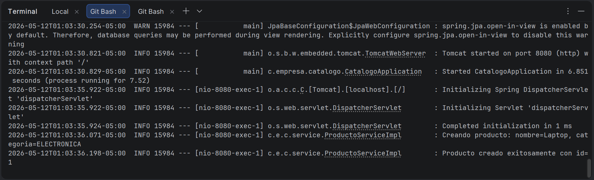
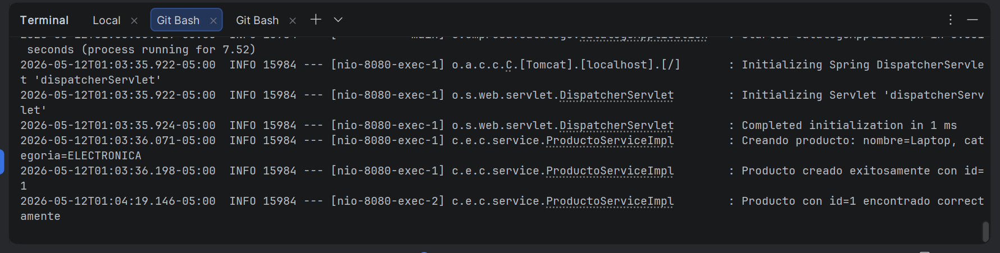
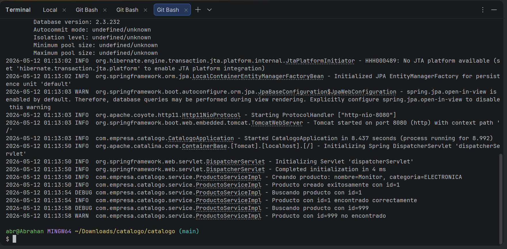
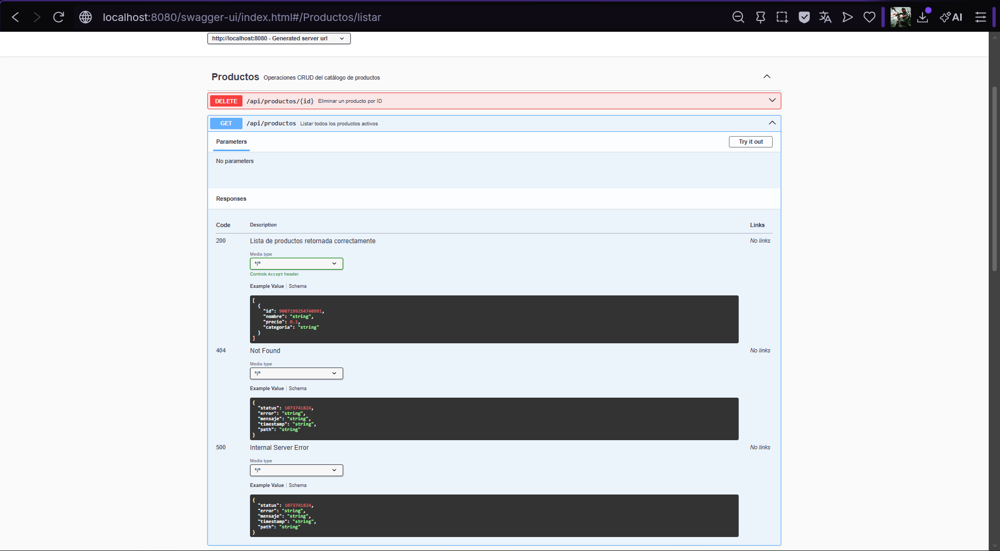

# Logging con SLF4J/Logback y Documentación con Swagger/OpenAPI

Aplicación Spring Boot de catálogo de productos con logging estructurado mediante SLF4J y Logback con rotación de archivos, y documentación interactiva de la API REST con springdoc-openapi y Swagger UI.

---

## Prerrequisitos

- Java 17 o superior
- Maven 3.9.x
- IDE con soporte Java (IntelliJ IDEA o VS Code con Extension Pack for Java)

---

## Cómo ejecutar el proyecto

### Iniciar la aplicación

```bash
mvn spring-boot:run
```

La aplicación inicia en `http://localhost:8080`. No requiere base de datos externa — usa H2 en memoria automáticamente.

---

## Swagger UI — Documentación interactiva

Una vez iniciada la aplicación, accede a la documentación interactiva en:

```
http://localhost:8080/swagger-ui.html
```

La definición OpenAPI en formato JSON está disponible en:

```
http://localhost:8080/api-docs
```

Swagger UI muestra el grupo **"Productos"** con los 4 endpoints documentados. Desde la interfaz puedes ejecutar peticiones directamente sin necesidad de Postman o curl.

---

## Endpoints disponibles

| Método | URL | Descripción | Status |
|--------|-----|-------------|--------|
| GET | `/api/productos` | Lista todos los productos activos | 200 |
| GET | `/api/productos/{id}` | Busca un producto por id | 200 / 404 |
| POST | `/api/productos` | Crea un nuevo producto | 201 / 400 |
| DELETE | `/api/productos/{id}` | Elimina un producto por id | 204 / 404 |

---

## Logging con SLF4J y Logback

### Ubicación de los archivos de log

Los archivos de log se generan automáticamente en la carpeta `logs/` en la raíz del proyecto:

```
logs/
└── catalogo.log          ← archivo de log del día actual
└── catalogo.2026-05-12.log  ← archivos rotados por día
```

> La carpeta `logs/` está en `.gitignore` y no se sube al repositorio.

### Ver el contenido del log en tiempo real

```bash
cat logs/catalogo.log
```

### Niveles de log configurados

| Nivel | Cuándo se usa |
|-------|--------------|
| `INFO` | Operaciones exitosas: crear, buscar, eliminar productos |
| `WARN` | Situaciones inusuales: producto no encontrado |
| `DEBUG` | Detalle interno: inicio de búsqueda por id |
| `ERROR` | Excepciones no controladas |

### Configuración de Logback

El archivo `src/main/resources/logback-spring.xml` configura dos appenders:

- **CONSOLA**: muestra logs en tiempo real con formato `HH:mm:ss NIVEL logger - mensaje`
- **ARCHIVO**: escribe en `logs/catalogo.log` con rotación diaria y 30 días de historial

El nivel global es `INFO` y el nivel del paquete `com.empresa.catalogo` es `DEBUG`.

### Ejemplo de mensajes de log

```
01:33:52 INFO  c.e.c.service.ProductoServiceImpl - Creando producto: nombre=Laptop, categoria=ELECTRONICA
01:33:52 INFO  c.e.c.service.ProductoServiceImpl - Producto creado exitosamente con id=1
01:33:52 DEBUG c.e.c.service.ProductoServiceImpl - Buscando producto con id=1
01:33:52 INFO  c.e.c.service.ProductoServiceImpl - Producto con id=1 encontrado correctamente
01:33:52 WARN  c.e.c.service.ProductoServiceImpl - Producto con id=999 no encontrado
01:33:52 INFO  c.e.c.service.ProductoServiceImpl - Eliminando producto con id=1
01:33:52 INFO  c.e.c.service.ProductoServiceImpl - Producto con id=1 eliminado correctamente
```

---

## Anotaciones de documentación Swagger aplicadas

### En `CatalogoApplication.java`
- `@OpenAPIDefinition` — define el título, versión y descripción general de la API

### En `ProductoController.java`
- `@Tag` — agrupa los endpoints bajo el nombre "Productos"
- `@Operation` — describe el propósito de cada endpoint
- `@ApiResponse` — documenta los códigos de respuesta posibles (200, 201, 400, 404)
- `@Parameter` — describe los parámetros de path con ejemplos

### En `ProductoRequestDTO.java`
- `@Schema` — documenta cada campo con descripción, ejemplo y valores permitidos

---

## Estructura del proyecto

```
src/
├── main/
│   ├── java/com/empresa/catalogo/
│   │   ├── CatalogoApplication.java       ← @OpenAPIDefinition
│   │   ├── controller/
│   │   │   └── ProductoController.java    ← @Tag, @Operation, @ApiResponse
│   │   ├── service/
│   │   │   ├── ProductoService.java
│   │   │   └── ProductoServiceImpl.java   ← Logger SLF4J con INFO/WARN/DEBUG
│   │   ├── repository/
│   │   │   └── ProductoRepository.java
│   │   ├── dto/
│   │   │   ├── ProductoRequestDTO.java    ← @Schema
│   │   │   └── ProductoResponseDTO.java
│   │   ├── entity/
│   │   │   └── Producto.java
│   │   ├── factory/
│   │   │   └── ProductoFactory.java
│   │   └── exception/
│   │       ├── ApiError.java
│   │       ├── GlobalExceptionHandler.java
│   │       └── RecursoNoEncontradoException.java
│   └── resources/
│       ├── application.properties
│       └── logback-spring.xml             ← Configuración Logback
logs/                                      ← Generado automáticamente (en .gitignore)
└── catalogo.log
```

---

## Evidencias

### Checkpoint 1 — Mensajes SLF4J en consola con formato correcto



### Checkpoint 2 — Archivo logs/catalogo.log con registros de operaciones


### Checkpoint 3 — Swagger UI con endpoints documentados

